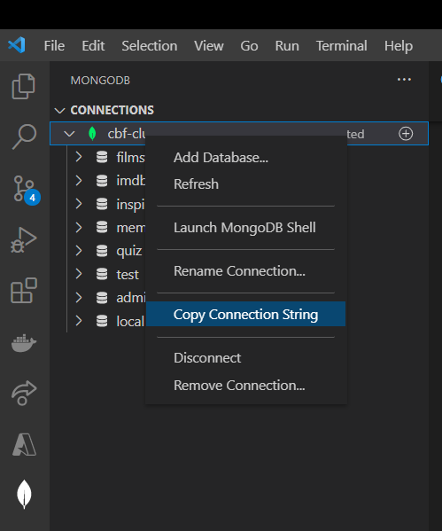

# Fullstack MERN Application: HR Viewer

For the following tasks we will finish the functionality for a fullstack MERN application.

This project consists of a:

1. MongoDB Database (`/server/seed/membership.mongodb`)
1. Node API (`/server/`)
1. React Front-End Application (`/client/`)

The application displays profile information from a database of people.

The functionality should allow a user to add, edit and delete people from the database.

Currently the application only has the functionality to display a person's details.

## Getting Started: Installation

Ensure you are running node version 16+

```
node -v
```

Go to your cloned project.

Navigate to your project root directory. Open the project folder  Visual Code and open a terminal window.

To install the project dependencies, run the following command from the root directory:

```
npm run dev-install
```
### Add Connection String / Config File

Add a folder to the root called `config`. Inside the config folder create a file called `default.json`.

Add the following lines of JSON:

``` JSON
{
  "mongoURI": "<CONNECTION STRING TO MONGODB ATLAS INSTANCE>"
}
```

Replace the `mongoURI` parameter string with a connection string to your MongoDB Atlas instance.

To find your connection string in Visual Studio Code, connect to your instance of MongoDB Atlas and right click the server. 

Click _"Copy the connection string"_ to copy to your clipboard. 



Paste the string into your `default.json` file.

Ensure your connection string is referencing the `membership` database

## Install Database Seed Data

Open Visual Studio Code. Ensure you are connected to your MongoDB Instance.

Open the seed data file [membership.mongodb](/server/seed/membership.mongodb) in Visual Studio and run the file to install people collection.

Once installed you should see 11 records in your MongoDB instance:


## Start the Development Server

To start the application, run the following command:

```
npm run develop
```

If your application is not working with the following error:

```
Error: error:0308010C:digital envelope routines::unsupported
```

Add the following flag to to your [/client/package.json](client/package.json) start command:

```JSON
"start": "react-scripts --openssl-legacy-provider start"
```  

## Task:

Currently the application only has the functionality to display a person's details.

Complete the application by adding the following functionality:

1. Add a new person to the application
2. Edit a person's details
3. Delete a person's profile

Visit http://localhost:3000 to view the application homepage

### Homepage View


### View Personal Details

